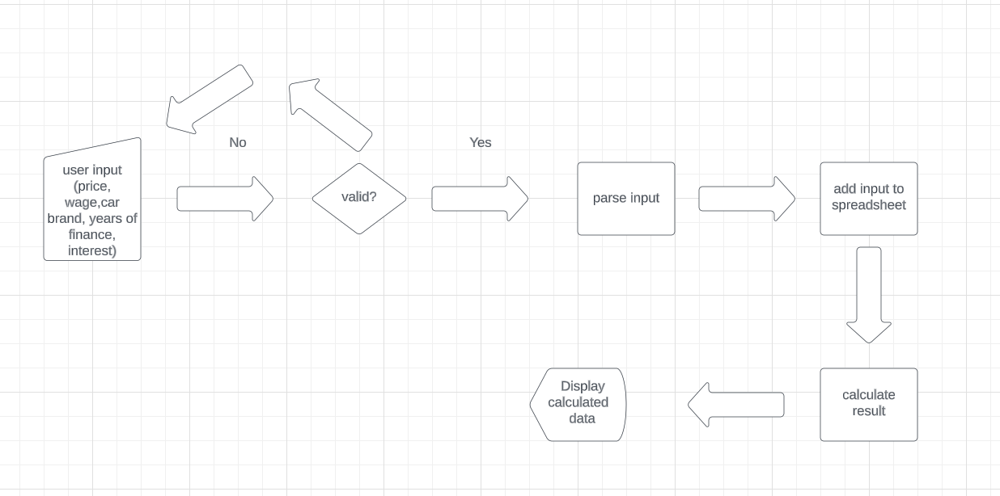

# Car Loan Calculator

[Car Loan Calculator](https://carloancalculator-029042eff7cd.herokuapp.com/)

This Python program uses Google Sheets to calculate and analyze the financial aspects of
a car loan. It takes user input for parameters such as price of the car, monthly wage,
car make, financing duration and expected interest. 
The calculated results, including monthly costs and affordability, are then stored in a Google Spreadsheet

## Table of Contents

- [Car Loan Calculator](#car-loan-calculator)
    - [Table of Contents](#table-of-contents)
    - [Technologies Used](#technologies-used)
        - [Languages Used](#languages-used)
        - [Frameworks and Libraries](#frameworks-and-libraries)
    - [Features](#features)
        - [User Input](#user-input)
        - [Data Validation](#data-validation)
        - [Resale Value Lookup](#resale-value-lookup)
        - [Google Sheets Interaction](#google-sheets-interaction)
        - [Cost Calculation](#cost-calculation)
    - [How To Use](#how-to-use)
    - [Manual Testing](#manual-testing)
    - [Credits](#credits)

## Technologies Used

### Languages Used

- Python

### Frameworks and Libraries

- gspread
- google.oauth2.service_account

## LucidCharts[Visit LucidCharts here](https://lucid.co/)

## Features

### User Input

This program prompts the user to enter information, in order: price of car, monthly wage, car make, financing duration and expected interest rate.
User can leave out interest rate if it is unknown and a default of 8% will be used for calculations

### Data validation

User input is validated to ensure all required data is provided in the correct format. The program then checks for numberic inputs to make sure numbers are where
they are supposed to be and checks to make sure no numbers are present in the car make input. It also checks the length of the input list to make sure the 
program has sufficient data to run. If user leaves the a number out, it is assumed it is the interest rate and a default of 8% is added.

### Resale Value Lookup

The car make entered by the user is cross-checked with predefined, made up values in a Google Spreadsheet to retreive an estimated resale value after 3 years.
If the car make is present, it will print out that based on our research, their car sell for x%.
If car make is not present in the predefined list and gives the user feedback that it is not known, but a 40% resale value is set. 

### Google Sheets Interaction

The program uses the `gspread` library to interact with a Google Spreadsheet. It updates two worksheets, "Finance" and "Results" using
user input data. It also reads values as listed in (#resale-value-lookup)

### Cost Calculation

This calculator calculate a standard 20% downpayment, a requirement for most car purchases, how much is left to finance and acost of the car loan
based of the user's input information. It evaluates affordability and stores the results in the "Results" worksheet

## How To Use

1. Clone the repository on GitHub
2. Install the required libraries using `pip install gspread oauth2client`.
3. Set up a Google API service account and download the credentials and rename the file to `creds.json`.
    (Don't forget to add this in your code enviroment, as well as adding `creds.json` to your git.ignore file if uploading to github!)
4. Create a Google Spreadsheet named "carloancalculator" with worksheets named: "Finance", "Carbrand" and "Result".
5. Run the program and enter the required information!

## Manual Testing

### Examples

1. **Input:** 2000,1000,bmw,30,5
    - **Expected Output:**
        - Downpayment: 400
        - Monthly Cost: 267
        - Can Afford: Yes
        - Resale Value: 45%
    - **Was Output As Expected?**
        - Yes
2. **Input:** 2000,880,bmw,30,5
    - **Expected Output:**
        - Downpayment: 400
        - Monthly Cost: 267
        - Can Afford: Maybe
        - Resale Value: 45%
    - **Was Output As Expected?**
        - Yes
3. **Input:** 2000,400,bmw,30,5
    - **Expected Output:**
        - Downpayment: 400
        - Monthly Cost: 267
        - Can Afford: No
        - Resale Value: 45%
    - **Was Output As Expected?**
        - Yes

### PyLint Results

The code has been run through Pylint with a score of 10/10. The following issues were
identified and addressed during testing:

- Trailing whitespaces removed
- An unused variable was removed
- Some unnecessary f-strings were corrected
- Some lines exceeding the recommended length(100 characters) were adjusted

## Credits

- Code Institute for providing the foundation of my knowledge of the gspread library and it's uses 
    during the code along project "Love Sandwiches". The code used and inspired by their project is commented in the run.py file.
- Google Sheets for facilitating data storage and analysis
- [gspread](https://gspread.readthedocs.io) and [google.oauth2.service_account](https://google-auth.readthedocs.io) 
    libraries for enabling Google Sheets interaction.
- Chat-GPT for specific code error. The code made with Chat-GPT is commented inside the run.py file. 
- Heroku for allowing cloud hosting for this app. (https://dashboard.heroku.com/apps)
- All other code is written by me 